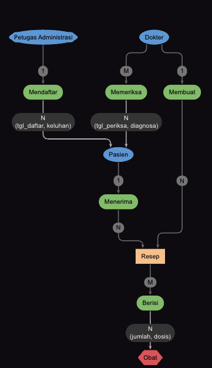
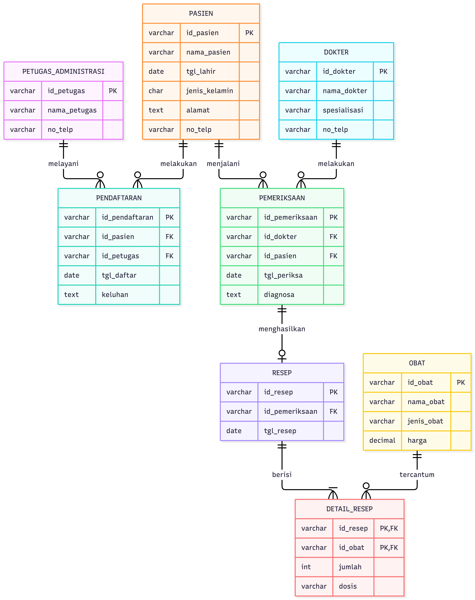

## SOAL

### Tugas 1 Praktikum Pembuatan ERD

Sebuah rumah sakit memiliki banyak dokter. Setiap dokter mempunyai banyak pasien yang harus ditangani. Pasien harus terlebih dahulu mendaftar pada bagian administrasi dengan menyerahkan data dirinya. Data pasien yang telah terdaftar akan diserahkan kepada dokter untuk diperiksa. Pasien dapat diperiksa oleh beberapa dokter sesuai situasi dan kondisi pasien. Setelah pasien selesai diperiksa, dokter akan membuat resep obat dan diserahkan kepada pasien.

Buatlah Entity Relationship Diagram (ERD) dari kasus di atas. [[Cek dan sesuaikan kalimat perintah ini dengan teks soal asli di e-learning.]]

## Program

ERD dibuat dalam dua tahap:

- ERD konseptual digambar dengan yEd Graph Editor (entitas, relasi, kardinalitas, dan atribut relasi).
- ERD logis (struktur tabel dengan PK dan FK) ditulis dengan Mermaid `erDiagram`, lalu dirender menjadi gambar.

### ERD konseptual (yEd)

### ERD logis (Mermaid)

Kode Mermaid:

!include(./erd-logis.mmd)

## Penjelasan program

### Langkah 1 Tandai kata benda dan kata kerja pada kasus

- Kata benda > kandidat entitas: Dokter, Pasien, Administrasi (petugas), Resep, Obat.
- Kata kerja > kandidat relasi: mendaftar, memeriksa, membuat resep, menerima resep, berisi (resep berisi obat).

### Langkah 2 Entitas

| Entitas | Alasan |
| ------- | ------ |
| Dokter | Pihak yang memeriksa pasien dan menulis resep |
| Pasien | Pihak yang mendaftar, diperiksa, dan menerima resep |
| Petugas_Administrasi | Bagian yang menerima pendaftaran dan data diri pasien |
| Resep | Hasil pemeriksaan, dibuat dokter untuk pasien |
| Obat | Isi resep; satu resep bisa berisi banyak obat |

### Langkah 3 Atribut dan primary key

| Entitas | Atribut (PK dicetak tebal) |
| ------- | -------------------------- |
| Dokter | **id_dokter**, nama_dokter, spesialisasi, no_telp |
| Pasien | **id_pasien**, nama_pasien, tgl_lahir, jenis_kelamin, alamat, no_telp |
| Petugas_Administrasi | **id_petugas**, nama_petugas, no_telp |
| Resep | **id_resep**, tgl_resep |
| Obat | **id_obat**, nama_obat, jenis_obat, harga |

### Langkah 4 Relasi dan kardinalitas (ERD konseptual)

| Relasi | Entitas | Kardinalitas | Aturan bisnis |
| ------ | ------- | ------------ | ------------- |
| Mendaftar | Petugas_Administrasi - Pasien | 1 : N | Satu petugas melayani banyak pendaftaran pasien. Atribut relasi: tgl_daftar, keluhan |
| Memeriksa | Dokter - Pasien | M : N | Satu dokter menangani banyak pasien; satu pasien bisa diperiksa beberapa dokter. Atribut relasi: tgl_periksa, diagnosa |
| Membuat | Dokter - Resep | 1 : N | Satu dokter membuat banyak resep; satu resep dibuat satu dokter |
| Menerima | Pasien - Resep | 1 : N | Satu pasien bisa menerima banyak resep; satu resep untuk satu pasien |
| Berisi | Resep - Obat | M : N | Satu resep berisi banyak obat; satu obat bisa ada di banyak resep. Atribut relasi: jumlah, dosis |

### Langkah 5 Transformasi ke ERD logis

Relasi M:N tidak bisa langsung menjadi tabel, jadi dipecah dengan entitas asosiatif:

- Memeriksa (Dokter - Pasien) > tabel **PEMERIKSAAN** dengan FK id_dokter dan id_pasien.
- Berisi (Resep - Obat) > tabel **DETAIL_RESEP** dengan PK gabungan (id_resep, id_obat).
- Mendaftar (1:N dengan atribut) > tabel **PENDAFTARAN**, supaya riwayat pendaftaran tersimpan.

| Relasi di ERD logis | Kardinalitas | Arti |
| ------------------- | ------------ | ---- |
| PETUGAS_ADMINISTRASI - PENDAFTARAN (melayani) | 1 : 0..N | Satu petugas melayani nol atau banyak pendaftaran |
| PASIEN - PENDAFTARAN (melakukan) | 1 : 0..N | Satu pasien bisa mendaftar berkali-kali |
| DOKTER - PEMERIKSAAN (melakukan) | 1 : 0..N | Satu dokter melakukan banyak pemeriksaan |
| PASIEN - PEMERIKSAAN (menjalani) | 1 : 0..N | Satu pasien bisa diperiksa beberapa kali / beberapa dokter |
| PEMERIKSAAN - RESEP (menghasilkan) | 1 : 0..1 | Satu pemeriksaan menghasilkan paling banyak satu resep |
| RESEP - DETAIL_RESEP (berisi) | 1 : 1..N | Satu resep minimal berisi satu obat |
| OBAT - DETAIL_RESEP (tercantum) | 1 : 0..N | Satu obat bisa tercantum di banyak resep |

Catatan desain: RESEP ditautkan ke PEMERIKSAAN (bukan langsung ke DOKTER dan PASIEN) karena satu pemeriksaan sudah membawa data dokter dan pasien, jadi tidak ada data ganda (redundansi).

### Langkah 6 Cek ulang

- Tiap entitas punya primary key.
- Tiap relasi punya kardinalitas tertulis (1, N, M).
- Relasi M:N sudah dipecah menjadi entitas asosiatif di ERD logis.
- Semua kalimat di kasus terwakili: daftar > PENDAFTARAN, periksa > PEMERIKSAAN, resep > RESEP dan DETAIL_RESEP.

## Bukti Video dengan Link Youtube

Link YouTube: [[(isi link YouTube, mode Public atau Unlisted)]]

Link Google Drive: [[(isi link Google Drive, akses "Anyone with the link")]]

[[Catatan (hapus setelah dicek): video wajib menampilkan wajah; di awal sebutkan Nama, NIM, Program studi (Sistem Informasi), dan Mata kuliah Basis Data (STSI4105); jelaskan tujuan praktikum, tunjukkan proses menggambar ERD di yEd secara langsung, jelaskan hasil ERD dan kardinalitasnya, lalu penutup singkat. Pastikan link bisa dibuka tanpa minta izin akses.]]

## Tangkapan Layar (Screenshot) Swafoto Bersama Layar Program

[[Simpan foto selfie bersama layar yEd yang menampilkan ERD sebagai basis-data-stsi4105/swafoto-layar-program.png lalu generate ulang, atau tempel langsung di Word.]]

# DAFTAR PUSTAKA

[[(Nama penulis BMP)]]. ([[tahun]]). *STSI4206 Basis data* ([[Edisi ke-...]]). Universitas Terbuka.

Mermaid. (n.d.). *Entity relationship diagrams*. https://mermaid.js.org/syntax/entityRelationshipDiagram.html

yWorks GmbH. (n.d.). *yEd graph editor* [Computer software]. https://www.yworks.com/products/yed
