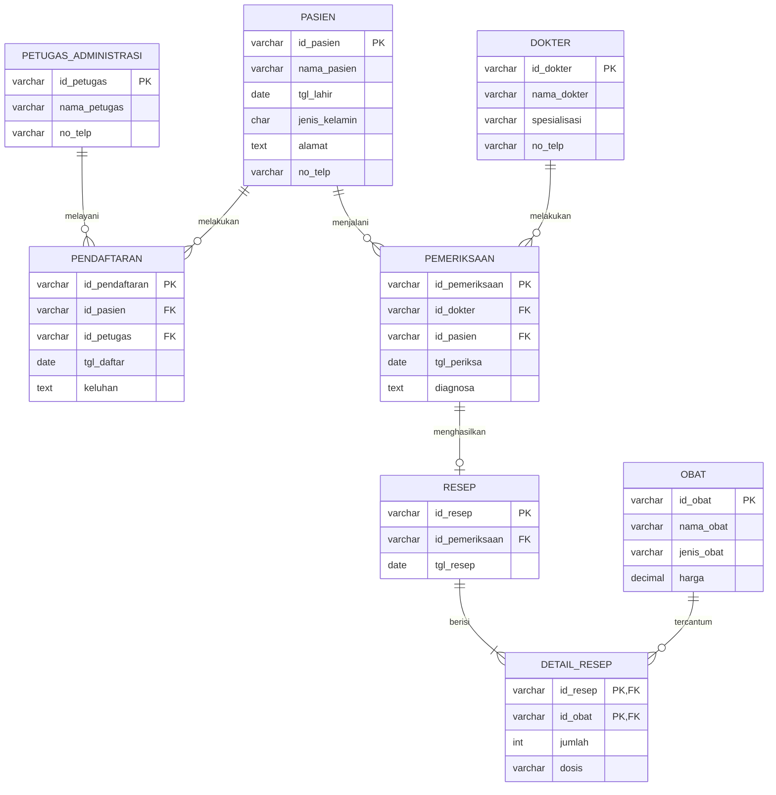

# Tugas 1 Basis Data (STSI4105): ERD Rumah Sakit

- Nama: I KD WIJAYA SASHMITHA ADHI C
- NIM: 048068753
- PRODI : Sistem Informasi

Tool gambar: **yEd Graph Editor** (sesuai Panduan Praktikum). Notasi: **Chen** (persegi = entitas, elips = atribut, belah ketupat = relasi, atribut kunci digarisbawahi).

---

## Langkah 1 Baca kasus, tandai kata benda & kata kerja

> Sebuah rumah sakit memiliki banyak **dokter**. Setiap dokter mempunyai banyak **pasien** yang harus _ditangani_. Pasien harus terlebih dahulu _mendaftar_ pada bagian **administrasi** dengan menyerahkan data dirinya. Data pasien yang telah terdaftar akan diserahkan kepada dokter untuk _diperiksa_. Pasien dapat diperiksa oleh beberapa dokter sesuai situasi dan kondisi pasien. Setelah pasien selesai diperiksa, dokter akan _membuat_ **resep obat** dan _diserahkan_ kepada pasien.

- Kata benda > kandidat entitas: Dokter, Pasien, Administrasi (petugas), Resep, Obat.
- Kata kerja > kandidat relasi: mendaftar, memeriksa, membuat resep, berisi (resep berisi obat).

## Langkah 2 Tentukan entitas

| Entitas              | Alasan                                              |
| -------------------- | --------------------------------------------------- |
| Dokter               | Pihak yang memeriksa pasien dan menulis resep       |
| Pasien               | Pihak yang mendaftar, diperiksa, dan menerima resep |
| Petugas_Administrasi | Bagian yang menerima pendaftaran & data diri pasien |
| Resep                | Hasil pemeriksaan, dibuat dokter untuk pasien       |
| Obat                 | Isi resep; satu resep bisa berisi banyak obat       |

## Langkah 3 Tentukan atribut & primary key

| Entitas              | Atribut (PK digarisbawahi di ERD)                                     |
| -------------------- | --------------------------------------------------------------------- |
| Dokter               | **id_dokter**, nama_dokter, spesialisasi, no_telp                     |
| Pasien               | **id_pasien**, nama_pasien, tgl_lahir, jenis_kelamin, alamat, no_telp |
| Petugas_Administrasi | **id_petugas**, nama_petugas, no_telp                                 |
| Resep                | **id_resep**, tgl_resep                                               |
| Obat                 | **id_obat**, nama_obat, jenis_obat, harga                             |

## Langkah 4 Tentukan relasi & kardinalitas

| Relasi    | Entitas                       | Kardinalitas | Aturan bisnis                                                                                                                |
| --------- | ----------------------------- | ------------ | ---------------------------------------------------------------------------------------------------------------------------- |
| Mendaftar | Petugas_Administrasi – Pasien | **1 : N**    | Satu petugas melayani banyak pendaftaran pasien; satu pendaftaran dilayani satu petugas. Atribut relasi: tgl_daftar, keluhan |
| Memeriksa | Dokter – Pasien               | **M : N**    | Satu dokter menangani banyak pasien; satu pasien bisa diperiksa beberapa dokter. Atribut relasi: tgl_periksa, diagnosa       |
| Membuat   | Dokter – Resep                | **1 : N**    | Satu dokter membuat banyak resep; satu resep dibuat satu dokter                                                              |
| Menerima  | Pasien – Resep                | **1 : N**    | Satu pasien bisa menerima banyak resep; satu resep untuk satu pasien                                                         |
| Berisi    | Resep – Obat                  | **M : N**    | Satu resep berisi banyak obat; satu obat bisa ada di banyak resep. Atribut relasi: jumlah, dosis                             |

## Langkah 5 Gambar ERD konseptual (Chen)

Susunan di yEd:

```text
                    [Petugas_Administrasi]
                              | 1
                         <Mendaftar> -- (tgl_daftar) (keluhan)
                              | N
[Dokter] M ---- <Memeriksa> ---- N [Pasien]
   | 1           (tgl_periksa)       | 1
   |             (diagnosa)          |
<Membuat>                        <Menerima>
   | N                               | N
   +------------ [Resep] ------------+
                    | M
                 <Berisi> -- (jumlah) (dosis)
                    | N
                  [Obat]
```

## Langkah 6 Transformasi ke ERD logis (relasi M:N dipecah)

Relasi M:N tidak bisa langsung jadi tabel, jadi dipecah dengan entitas asosiatif:

- Memeriksa (Dokter–Pasien) > tabel **Pemeriksaan**
- Berisi (Resep–Obat) > tabel **Detail_Resep**
- Mendaftar (1:N dengan atribut) > tabel **Pendaftaran** (supaya riwayat pendaftaran tersimpan)



Catatan desain: Resep ditautkan ke Pemeriksaan (bukan langsung ke Dokter & Pasien) karena satu pemeriksaan sudah membawa info dokter + pasien, jadi tidak ada data dobel.

## Langkah 7 Cek ulang

- [ ] Tiap entitas punya PK
- [ ] Tiap relasi punya kardinalitas tertulis (1, N, M)
- [ ] M:N sudah dipecah jadi entitas asosiatif di ERD logis
- [ ] Semua kalimat di kasus terwakili (daftar > Pendaftaran, periksa > Pemeriksaan, resep > Resep + Detail_Resep)

---

## Cara gambar di yEd (ringkas)

1. File > New. Palette > pilih **Entity Relationship**.
2. Tarik **Entity** (persegi) untuk tiap entitas, beri nama.
3. Tarik **Attribute** (elips) untuk atribut; untuk PK pakai **Primary Key Attribute** (teks bergaris bawah).
4. Tarik **Relationship** (belah ketupat) di antara entitas; hubungkan pakai edge.
5. Klik edge > label kardinalitas (1 / N / M).
6. Layout > Orthogonal/Organic biar rapi. File > Export > PNG untuk hasil.

## Kerangka video laporan (wajib 4 elemen)

1. **Perkenalan**: nama, NIM, UPBJJ, mata kuliah STSI4105, Tugas 1 ERD.
2. **Langkah praktik**: tampilkan kasus > tandai entitas/relasi (Langkah 1–4) > gambar di yEd live (Langkah 5) > jelaskan pemecahan M:N (Langkah 6).
3. **Hasil**: tunjukkan ERD final, jelaskan tiap relasi + kardinalitas satu per satu.
4. **Penutup**: kesimpulan singkat + terima kasih.

Sumber: BMP STSI4206 Basis Data (modul ERD) + Panduan Praktikum STSI4105.
