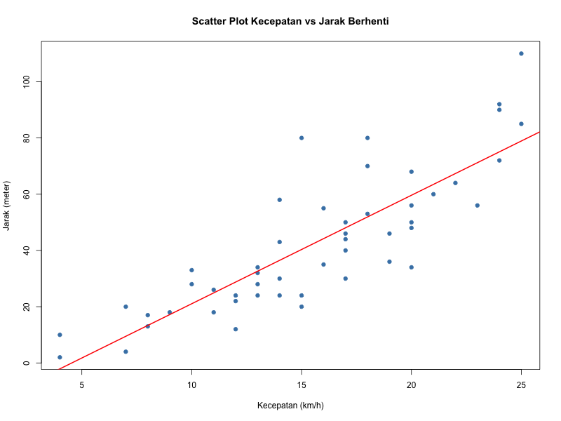
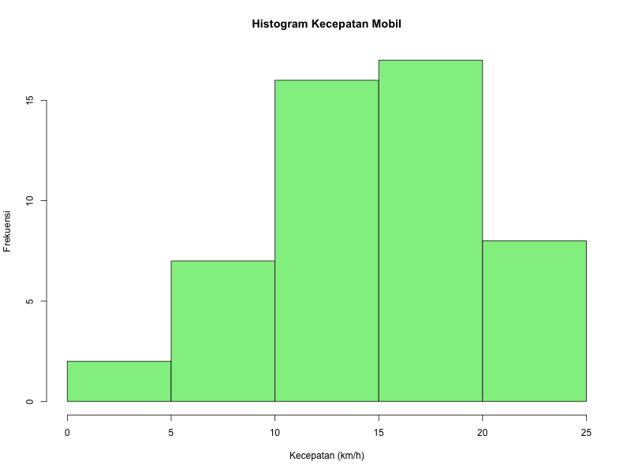

## SOAL

### Tugas Tutorial 1

**1.** Berikut ini adalah data kecepatan mobil dan jarak yang ditempuh mobil hingga berhenti. (Skor 30, Modul 1 KB 1.5)

| No. | Kecepatan (km/h) | Jarak (meter) | No. | Kecepatan (km/h) | Jarak (meter) |
| --- | --- | --- | --- | --- | --- |
| 1 | 4 | 2 | 26 | 16 | 55 |
| 2 | 4 | 10 | 27 | 16 | 35 |
| 3 | 7 | 4 | 28 | 17 | 40 |
| 4 | 7 | 20 | 29 | 17 | 30 |
| 5 | 8 | 17 | 30 | 17 | 44 |
| 6 | 8 | 13 | 31 | 17 | 50 |
| 7 | 9 | 18 | 32 | 17 | 46 |
| 8 | 10 | 28 | 33 | 18 | 53 |
| 9 | 10 | 33 | 34 | 18 | 70 |
| 10 | 11 | 18 | 35 | 18 | 80 |
| 11 | 11 | 26 | 36 | 19 | 36 |
| 12 | 12 | 12 | 37 | 19 | 46 |
| 13 | 12 | 24 | 38 | 20 | 68 |
| 14 | 12 | 22 | 39 | 20 | 34 |
| 15 | 13 | 28 | 40 | 20 | 48 |
| 16 | 13 | 24 | 41 | 20 | 50 |
| 17 | 13 | 32 | 42 | 20 | 56 |
| 18 | 13 | 34 | 43 | 21 | 60 |
| 19 | 14 | 43 | 44 | 22 | 64 |
| 20 | 14 | 24 | 45 | 23 | 56 |
| 21 | 14 | 30 | 46 | 24 | 72 |
| 22 | 14 | 58 | 47 | 24 | 90 |
| 23 | 15 | 80 | 48 | 24 | 92 |
| 24 | 15 | 20 | 49 | 25 | 110 |
| 25 | 15 | 24 | 50 | 25 | 85 |

Gunakan R untuk menghitung nilai berikut (jawaban harus melampirkan hasil kerja di R):

- a. Rata-rata kecepatan mobil (10)
- b. Rata-rata jarak yang ditempuh mobil (10)
- c. Standar deviasi data jarak yang ditempuh mobil (10)

**2.** Berdasarkan tabel pada soal nomor 1, gunakan program R untuk membuat plot dan interpretasikan hasilnya! (Skor 50, Modul 1 KB 1.16)

- a. Scatter plot dari data kecepatan dan jarak (10)
- b. Interpretasi scatter plot yang diperoleh (15)
- c. Histogram untuk data kecepatan mobil (10)
- d. Interpretasi histogram yang diperoleh (15)

**3.** Thomas memperoleh nilai 80 untuk ujian Matematika dengan rata-rata kelas 75 dan standar deviasi 10. Untuk ujian bahasa Inggris, Thomas memperoleh nilai 75 dengan rata-rata kelas 70 dan standar deviasi 8. Hitunglah koefisien keragaman untuk nilai ujian Matematika dan bahasa Inggris Thomas! (Skor 20, Modul 1 KB 1.31)

## Program

Program ditulis dalam bahasa R memakai VS Code. Semua jawaban ada di satu file `tugas1-stsi4204.R`, bisa dijalankan sekaligus dengan perintah `Rscript tugas1-stsi4204.R` atau baris per baris dengan Cmd + Enter. Plot otomatis tersimpan sebagai `scatter-kecepatan-jarak.png` dan `histogram-kecepatan.png`.

!include(./tugas1-stsi4204.R)

## Penjelasan program

Fungsi R yang dipakai:

| Fungsi | Kegunaan |
| --- | --- |
| `c()` | Membuat vector dari data kecepatan dan jarak |
| `data.frame()` | Menggabungkan vector menjadi tabel data `mobil` |
| `mean()` | Menghitung rata-rata |
| `sd()` | Menghitung standar deviasi sampel (pembagi n - 1) |
| `plot()` dan `abline(lm())` | Membuat scatter plot dan garis regresi |
| `cor()` | Menghitung koefisien korelasi |
| `hist()` | Membuat histogram |
| `table(cut())` | Menghitung frekuensi tiap kelas histogram |

### Soal 1 Rata-rata dan standar deviasi

Data 50 mobil dimasukkan sebagai vector `kecepatan` dan `jarak`, lalu digabung ke data frame `mobil`.

```r
mean(mobil$kecepatan)   # a
mean(mobil$jarak)       # b
sd(mobil$jarak)         # c
```

Output:

```text
[1] 15.5
[1] 42.28
[1] 24.76505
```

| Poin | Ukuran | Hasil |
| ---- | ------ | ----- |
| a | Rata-rata kecepatan mobil | 15,5 km/h |
| b | Rata-rata jarak yang ditempuh mobil | 42,28 meter |
| c | Standar deviasi jarak | 24,77 meter |

### Soal 2a Scatter plot

```r
plot(mobil$kecepatan, mobil$jarak,
     main = "Scatter Plot Kecepatan vs Jarak Berhenti",
     xlab = "Kecepatan (km/h)", ylab = "Jarak (meter)",
     pch = 19, col = "steelblue")
abline(lm(jarak ~ kecepatan, data = mobil), col = "red", lwd = 2)
cor(mobil$kecepatan, mobil$jarak)
```

Output: korelasi `[1] 0.8384031`, garis regresi intercept -17.535 dan slope 3.859.



### Soal 2b Interpretasi scatter plot

- Titik-titik naik dari kiri bawah ke kanan atas, artinya hubungan positif: makin tinggi kecepatan, makin jauh jarak berhenti.
- Hubungannya kuat, koefisien korelasi r = 0,838.
- Garis regresi: jarak = −17,53 + 3,86 × kecepatan. Tiap kecepatan naik 1 km/h, jarak berhenti bertambah rata-rata sekitar 3,86 meter.
- Sebaran titik makin melebar di kecepatan tinggi (18–25 km/h), jadi variasi jarak berhenti makin besar saat mobil lebih cepat.
- Ada potensi outlier, misalnya kecepatan 15 km/h dengan jarak 80 m dan kecepatan 25 km/h dengan jarak 110 m.

### Soal 2c Histogram kecepatan

```r
hist(mobil$kecepatan,
     main = "Histogram Kecepatan Mobil",
     xlab = "Kecepatan (km/h)", ylab = "Frekuensi",
     col = "lightgreen", border = "black")
table(cut(mobil$kecepatan, breaks = seq(0, 25, by = 5)))
```



| Kelas (km/h) | Frekuensi |
| ------------ | --------- |
| 0–5 | 2 |
| 5–10 | 7 |
| 10–15 | 16 |
| 15–20 | 17 |
| 20–25 | 8 |

### Soal 2d Interpretasi histogram

- Sebagian besar mobil berada di kecepatan 10–20 km/h (33 dari 50 mobil = 66%).
- Kelas dengan frekuensi tertinggi ada di 15–20 km/h (17 mobil).
- Distribusi relatif simetris, sedikit condong ke kiri: mean (15,5) sama dengan median (15,5), ekor kiri (0–10 km/h) sedikit lebih panjang dengan frekuensi kecil.
- Rentang data 4–25 km/h, tidak ada nilai ekstrem yang terpisah jauh.

### Soal 3 Koefisien keragaman

Rumus: KK = standar deviasi / rata-rata × 100%

```r
kk_matematika <- 10 / 75 * 100
kk_inggris <- 8 / 70 * 100
kk_matematika
kk_inggris
```

Output:

```text
[1] 13.33333
[1] 11.42857
```

| Ujian | Rata-rata kelas | SD | KK |
| ----- | --------------- | -- | -- |
| Matematika | 75 | 10 | 10 / 75 × 100% = 13,33% |
| Bahasa Inggris | 70 | 8 | 8 / 70 × 100% = 11,43% |

- KK Matematika (13,33%) lebih besar dari KK Bahasa Inggris (11,43%), jadi nilai ujian Matematika lebih beragam (heterogen), sedangkan nilai Bahasa Inggris lebih seragam (homogen).
- Sebagai pembanding, nilai baku Thomas: Matematika (80 − 75) / 10 = 0,5 dan Bahasa Inggris (75 − 70) / 8 = 0,625. Posisi relatif Thomas lebih baik di Bahasa Inggris walaupun nilai mentahnya lebih kecil.

## Bukti Video dengan Link Youtube

Link YouTube: [[(isi link YouTube, mode Public atau Unlisted)]]

Link Google Drive: [[(isi link Google Drive, akses "Anyone with the link")]]

[[Catatan (hapus setelah dicek): video wajib menampilkan wajah; di awal sebutkan Nama, NIM, Program studi (Sistem Informasi), dan Mata kuliah; jelaskan tugas singkat, demo program dijalankan langsung, jelaskan hasil, lalu penutup singkat. Pastikan link bisa dibuka tanpa minta izin akses.]]

## Tangkapan Layar (Screenshot) Swafoto Bersama Layar Program

[[Simpan foto selfie bersama layar program (R / VS Code menampilkan output) sebagai data-analytics-using-r/swafoto-layar-program.png lalu generate ulang, atau tempel langsung di Word.]]


# DAFTAR PUSTAKA

[[(Nama penulis BMP)]]. ([[tahun]]). *MSIM4310 Analisis dan visualisasi data* ([[Edisi ke-...]]). Universitas Terbuka.

R Core Team. ([[tahun rilis versi R yang dipakai]]). *R: A language and environment for statistical computing*. R Foundation for Statistical Computing. https://www.R-project.org/
