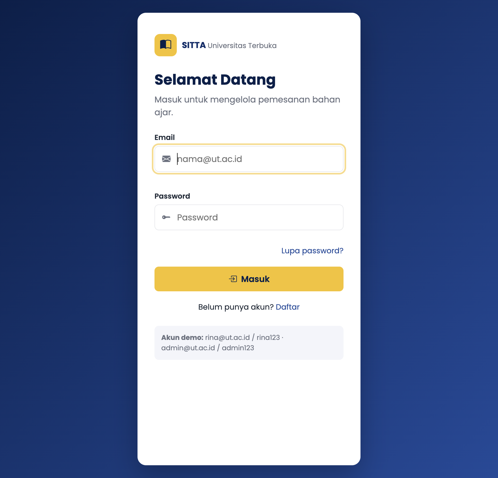
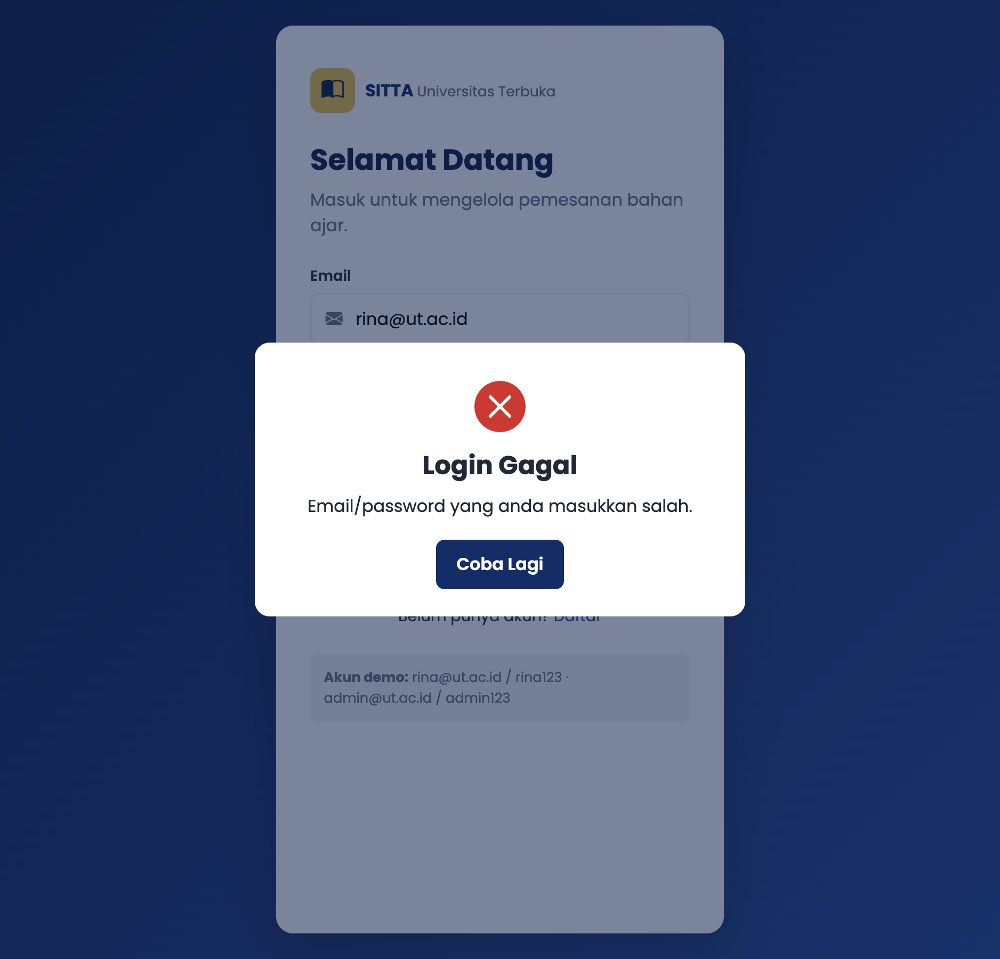
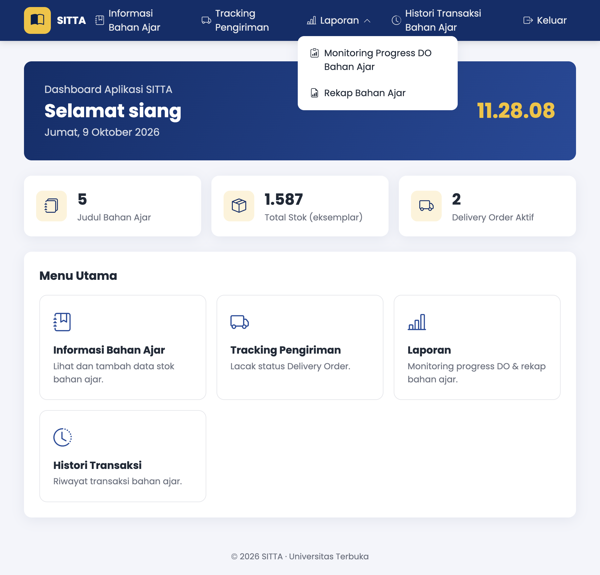
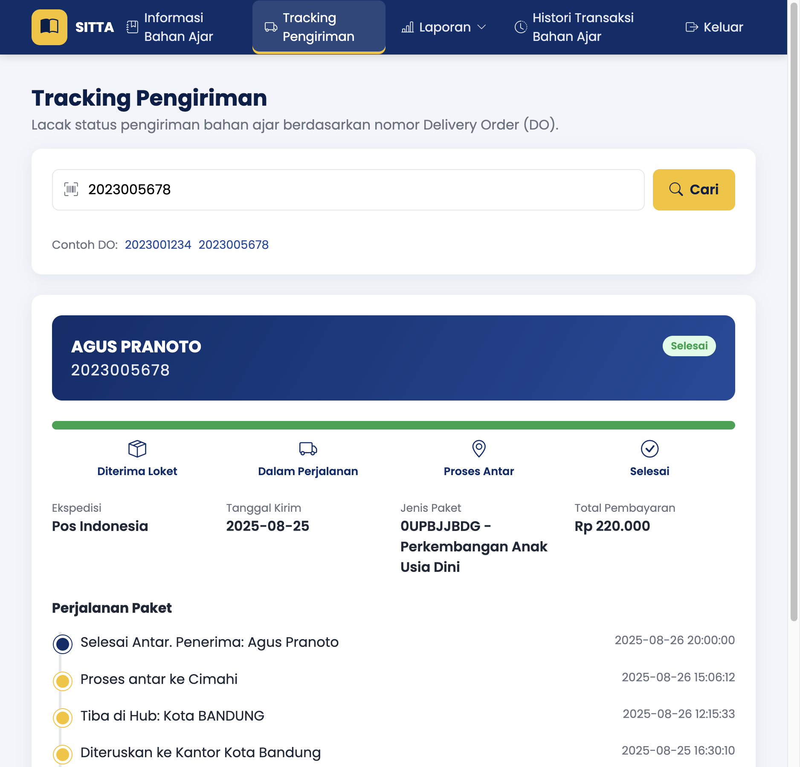
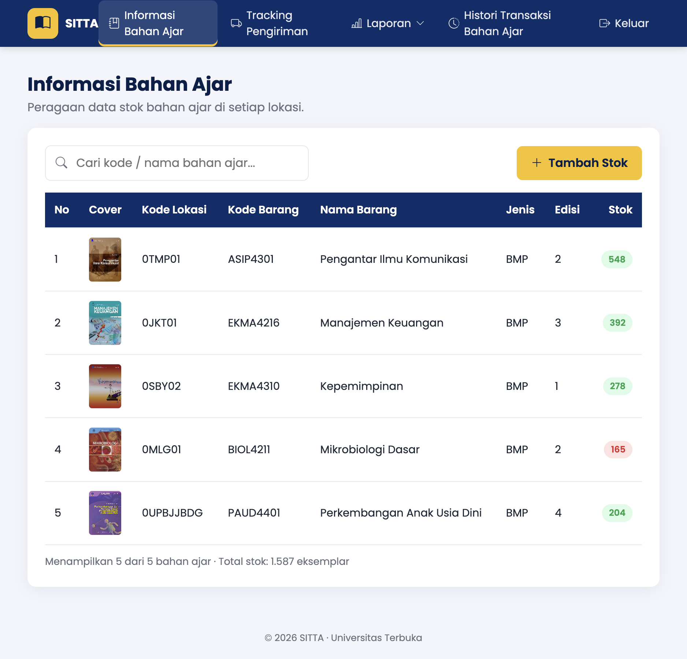
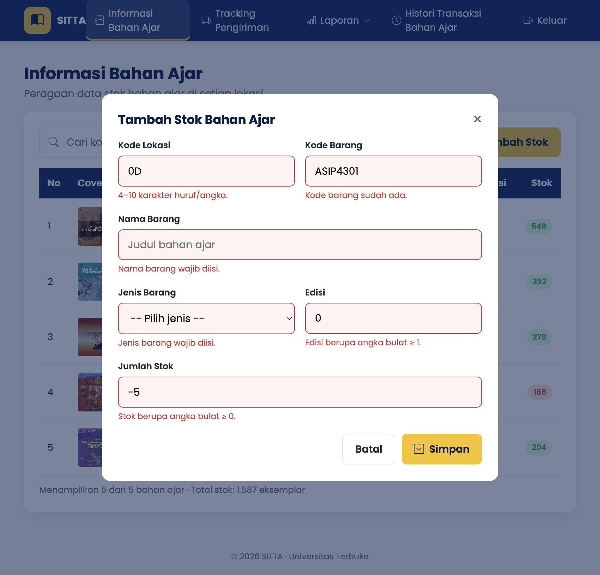

## SOAL

### Tujuan

Mahasiswa mampu mengimplementasikan konsep fundamental HTML, CSS, dan JavaScript DOM untuk membangun antarmuka dan alur interaktif dari aplikasi pemesanan bahan ajar SITTA untuk sistem kebutuhan proses pemesanan dan distribusi bahan ajar di UT.

Indikator hasil belajar:

- Mahasiswa dapat merancang struktur HTML yang semantik dan valid.
- Mahasiswa dapat mengelola gaya antarmuka menggunakan CSS (inline, internal, external).
- Mahasiswa dapat menggunakan JavaScript untuk manipulasi DOM, validasi form, manipulasi data tabel, dan interaksi UI sesuai kreativitas masing-masing seperti pop-up, modal box, dan alert box.

### Soal Tugas

Anda diminta untuk membuat sebuah aplikasi website sederhana untuk pemesanan Bahan Ajar di Universitas Terbuka yang dilakukan oleh UT-Daerah. Pada tugas ini, mahasiswa berfokus pada proses Front-End tanpa menggunakan Back-End terlebih dahulu, sehingga data yang dibutuhkan tidak dibaca melalui database, tetapi melalui file js yang dilampirkan bersama Tugas Praktik ini. Buatlah empat halaman website sebagai berikut:

**1. Halaman Login (login.html)**

- Input: email dan password.
- Tombol "Login".
- Jika salah atau tidak sesuai, muncul pop-up/alert yang berisi "email/password yang anda masukkan salah".
- Terdapat tombol "Lupa Password" dan "Daftar" yang dimunculkan dalam modal box/pop up.

**2. Dashboard Menu (dashboard.html)**

- Menu utama berupa tombol navigasi ke: Informasi Bahan Ajar, Tracking Pengiriman, Laporan (Monitoring Progress DO Bahan Ajar, Rekap Bahan Ajar), dan Histori Transaksi Bahan Ajar.
- Tampilkan "greeting" berdasarkan waktu local time (pagi/siang/sore).

**3. Tracking Pengiriman (tracking.html)**

- Input: Nomor Delivery Order.
- Ketika tombol "Cari" ditekan, tampilkan: Nama Mahasiswa; Status Pengiriman (dapat disimulasikan dengan progress bar, warna, tabel, atau list); detail ekspedisi, tanggal kirim, jenis paket, total pembayaran.

**4. Informasi Stok Bahan Ajar (stok.html)**

- Menampilkan secara dinamis data dummy pada data.js di variable konstanta dataBahanAjar.
- Terdapat fitur untuk menambahkan baris stok baru menggunakan JavaScript DOM.

Struktur folder proyek: `index.html` (halaman login), `dashboard.html`, `tracking.html`, `stok.html`, `css/style.css`, `js/script.js`, `assets/` (logo-ut.png opsional). Data dummy disimpan dalam folder js.

### Kriteria Penilaian

| No  | Kriteria                                                         | Poin |
| --- | ---------------------------------------------------------------- | ---- |
| 1.1 | Struktur HTML yang semantik, valid, dan lengkap                  | 15   |
| 1.2 | Desain CSS                                                       | 15   |
| 1.3 | JavaScript DOM (interaktivitas dan manipulasi data)              | 25   |
| 1.4 | Validasi Form & Alert (feedback saat error)                      | 15   |
| 1.5 | Modularitas File dan Struktur File                               | 5    |
| 1.6 | Kreativitas tambahan (tema, fitur, UI)                           | 10   |
| 1.7 | Penjelasan dalam video (sistematika, alur berpikir, argumentasi) | 15   |

Durasi video penjelasan maksimal 15 menit.

## Program

Aplikasi dibuat dengan HTML, CSS, dan JavaScript murni (tanpa framework), memakai VS Code. Cara menjalankan: buka `index.html` di browser, atau jalankan server lokal `npx serve .` di folder `sitta-praktik`. Akun demo: `rina@ut.ac.id` / `rina123` dan `admin@ut.ac.id` / `admin123`. Nomor DO contoh: `2023001234` dan `2023005678`.

Struktur folder:

```text
sitta-praktik/
├── index.html        halaman login
├── dashboard.html    menu utama + greeting
├── tracking.html     tracking Delivery Order
├── stok.html         informasi stok bahan ajar
├── css/style.css     stylesheet eksternal
├── js/data.js        data dummy (dataPengguna, dataBahanAjar, dataTracking)
├── js/script.js      logika DOM semua halaman
└── assets/img/       cover bahan ajar
```

Kode lengkap `css/style.css` (848 baris) ada di file source code yang dikumpulkan; cuplikannya ada di bagian Penjelasan program.

### index.html

!include(./sitta-praktik/index.html)

### dashboard.html

!include(./sitta-praktik/dashboard.html)

### tracking.html

!include(./sitta-praktik/tracking.html)

### stok.html

!include(./sitta-praktik/stok.html)

### js/data.js

!include(./sitta-praktik/js/data.js)

### js/script.js

!include(./sitta-praktik/js/script.js)

## Penjelasan program

### Alur berpikir

Analisis soal > rancang 4 halaman dan struktur folder > tulis HTML semantik > beri gaya dengan CSS > tambahkan interaksi JavaScript DOM > uji tiap skenario (input benar dan salah).

Semua halaman memuat `js/data.js` (data) lalu `js/script.js` (logika). Di `script.js` ada router sederhana: tiap `<body>` punya atribut `data-page` (login, dashboard, tracking, stok), lalu saat `DOMContentLoaded` fungsi `init` yang sesuai dijalankan. Jadi satu file script dipakai bersama tanpa saling bentrok.

### 1. Halaman Login (index.html)



| Bagian            | Penjelasan                                                                                                                                                                |
| ----------------- | ------------------------------------------------------------------------------------------------------------------------------------------------------------------------- |
| HTML              | `main.login-card` berisi `header` (brand, judul), `form#loginForm` dengan `label` untuk tiap input, dan `aside` akun demo. Tiga modal: login gagal, lupa password, daftar |
| `initLoginPage()` | Saat submit, `e.preventDefault()` lalu validasi email (wajib + format regex) dan password (wajib)                                                                         |
| Cek akun          | `dataPengguna.find()` mencocokkan email dan password. Jika tidak ada > `openModal("loginErrorModal")` berisi "Email/password yang anda masukkan salah."                   |
| Login benar       | Toast "Login berhasil. Selamat datang, Rina Wulandari!" lalu pindah ke `dashboard.html`                                                                                   |
| Lupa password     | Modal; email wajib valid dan harus terdaftar, jika tidak muncul pesan "Email tidak terdaftar."                                                                            |
| Daftar            | Modal; nama, email, unit wajib diisi, password minimal 6 karakter, email tidak boleh sudah terdaftar                                                                      |



### 2. Dashboard (dashboard.html)

| Bagian          | Penjelasan                                                                                                                                                                                 |
| --------------- | ------------------------------------------------------------------------------------------------------------------------------------------------------------------------------------------ |
| Navbar          | `header.navbar > nav > ul`. Menu: Informasi Bahan Ajar, Tracking Pengiriman, Laporan (dropdown: Monitoring Progress DO Bahan Ajar, Rekap Bahan Ajar), Histori Transaksi Bahan Ajar, Keluar |
| Dropdown        | Klik tombol Laporan menambah class `open`; klik di luar menutup dropdown                                                                                                                   |
| Hamburger       | Di layar kecil menu disembunyikan, tombol `#navToggle` membuka/menutup menu                                                                                                                |
| Greeting        | `getGreeting(jam)`: 04.00 sampai 10.59 "Selamat pagi", 11.00 sampai 14.59 "Selamat siang", 15.00 sampai 18.59 "Selamat sore", selain itu "Selamat malam"                                   |
| Jam real-time   | `updateClock()` dipanggil tiap 1 detik dengan `setInterval`, memakai `toLocaleTimeString("id-ID")`                                                                                         |
| Statistik       | Dihitung dari data: 5 judul bahan ajar, total stok 1.587 eksemplar, 2 Delivery Order                                                                                                       |
| Fitur belum ada | Menu Laporan dan Histori memunculkan toast "Fitur ... segera hadir."; tombol Keluar memakai `confirm()`                                                                                    |



### 3. Tracking Pengiriman (tracking.html)

| Bagian             | Penjelasan                                                                                                                                                                                          |
| ------------------ | --------------------------------------------------------------------------------------------------------------------------------------------------------------------------------------------------- |
| Validasi           | Nomor DO wajib diisi dan hanya angka (`/^\d+$/`)                                                                                                                                                    |
| Cari data          | `dataTracking[nomor]`; jika tidak ada > toast error "Nomor DO ... tidak ditemukan."                                                                                                                 |
| `renderTracking()` | Menampilkan nama mahasiswa, nomor DO, badge status, progress bar, stepper 4 tahap, detail (ekspedisi, tanggal kirim, jenis paket, total pembayaran), dan timeline perjalanan (urut terbaru di atas) |
| Progress           | `getTahapPengiriman()` membaca kata kunci di keterangan log: penerimaan, hub, proses antar, selesai antar. Persen = tahap / 4 × 100                                                                 |
| Tombol contoh DO   | Mengisi input otomatis lalu `form.requestSubmit()`                                                                                                                                                  |

Hasil untuk dua DO di `data.js`:

| Nomor DO   | Nama           | Status           | Tahap terakhir          | Progress |
| ---------- | -------------- | ---------------- | ----------------------- | -------- |
| 2023001234 | Rina Wulandari | Dalam Perjalanan | Tiba di Hub (tahap 2)   | 50%      |
| 2023005678 | Agus Pranoto   | Selesai          | Selesai Antar (tahap 4) | 100%     |



### 4. Informasi Stok Bahan Ajar (stok.html)

| Bagian          | Penjelasan                                                                                                                                                                              |
| --------------- | --------------------------------------------------------------------------------------------------------------------------------------------------------------------------------------- |
| Render tabel    | `renderStokTable()` membuat `<tr>` dan `<td>` dengan `document.createElement` dari `dataBahanAjar` (cover, kode lokasi, kode barang, nama, jenis, edisi, stok)                          |
| Badge stok      | Stok di bawah 200 diberi badge merah "Stok menipis" (Mikrobiologi Dasar, 165), selain itu hijau                                                                                         |
| Pencarian live  | Event `input` pada kotak cari menyaring berdasarkan kode barang, nama, atau kode lokasi                                                                                                 |
| Tambah stok     | Modal form; data baru di-`push` ke `dataBahanAjar`, tabel dirender ulang, baris baru disorot                                                                                            |
| Validasi tambah | Kode lokasi 4 sampai 10 huruf/angka; kode barang format 4 huruf + 4 angka dan tidak boleh duplikat; nama dan jenis wajib; edisi bilangan bulat minimal 1; stok bilangan bulat minimal 0 |
| Ringkasan       | Teks di bawah tabel: jumlah data yang tampil dan total stok                                                                                                                             |





### Pemetaan ke kriteria penilaian

| Kriteria             | Implementasi                                                                                                                                                                                                             |
| -------------------- | ------------------------------------------------------------------------------------------------------------------------------------------------------------------------------------------------------------------------ |
| 1.1 HTML semantik    | `header`, `nav`, `main`, `section`, `article`, `aside`, `footer`, `dl`, `time`, `table` dengan `thead` dan `th scope`, `label for`, atribut `aria-*`, `lang="id"`                                                        |
| 1.2 CSS              | External `css/style.css` untuk semua halaman; internal `<style>` di `tracking.html` (header DO, progress bar, stepper, timeline); inline `style=""` pada beberapa elemen; CSS variables, flex/grid, animasi, media query |
| 1.3 JavaScript DOM   | Render tabel stok, tambah baris, pencarian live, render hasil tracking, greeting dan jam real-time, statistik dashboard, dropdown dan hamburger menu                                                                     |
| 1.4 Validasi & alert | Validasi semua form dengan pesan error di bawah input, modal login gagal, toast sukses/gagal, `confirm()` saat keluar                                                                                                    |
| 1.5 Modularitas      | HTML, CSS, JS, data, dan gambar dipisah per folder sesuai struktur soal; `script.js` dipecah per fungsi dan per halaman                                                                                                  |
| 1.6 Kreativitas      | Tema warna navy dan kuning UT, Bootstrap Icons, toast notification, stepper status pengiriman, badge stok menipis, tampilan responsive untuk mobile, tombol contoh DO                                                    |

### Cuplikan tiga jenis CSS

External (`css/style.css`), variabel warna tema:

```css
:root {
  --navy: #0b2e6b;
  --yellow: #f6c21c;
  --success: #16a34a;
  --danger: #dc2626;
  --radius: 12px;
}
```

Internal (`<style>` di `tracking.html`), progress bar pengiriman:

```css
.progress-bar {
  height: 100%;
  width: 0;
  background: var(--yellow);
  transition: width 0.8s ease;
}
```

Inline (`index.html`):

```html
<span>SITTA <small style="font-weight: 400; color: #6b7280">Universitas Terbuka</small></span>
```

### Perbaikan data.js

- `dataTracking["2023005678"].nomorDO` sebelumnya `"2023001234"` (dobel), diperbaiki menjadi `"2023005678"`, dan status menjadi `"Selesai"` karena log terakhir "Selesai Antar".
- Waktu log ke-3 DO `2023001234` sebelumnya sama dengan log pertama (10:12:20), diubah menjadi `16:45:10` supaya urut.
- Path cover `img/...` diubah menjadi `assets/img/...` sesuai struktur folder; cover PAUD memakai ekstensi `.jpeg` sesuai file aslinya.

## Bukti Video dengan Link Youtube

Link YouTube: [[(isi link YouTube, mode Public atau Unlisted)]]

Link Google Drive: [[(isi link Google Drive, akses "Anyone with the link")]]

[[Catatan (hapus setelah dicek): durasi maksimal 15 menit; video wajib menampilkan wajah; di awal sebutkan Nama, NIM, Program studi (Sistem Informasi), dan Mata kuliah STSI4209; jelaskan alur berpikir dan struktur file, demo semua halaman (login salah dan benar, dashboard, tracking, stok tambah valid dan tidak valid), jelaskan hasil, lalu penutup singkat.]]

## Tangkapan Layar (Screenshot) Swafoto Bersama Layar Program

[[Simpan foto selfie bersama layar aplikasi SITTA yang sedang berjalan sebagai web-programming/laporan-img/swafoto-layar-program.png lalu generate ulang, atau tempel langsung di Word.]]


# DAFTAR PUSTAKA

Sufandi, U. U. (2022). Analisis kebutuhan dan dokumentasi sistem informasi tiras dan transaksi bahan ajar Universitas Terbuka. _Jurnal Nasional Pendidikan Teknik Informatika: JANAPATI, 11_(2), 112-122. https://doi.org/10.23887/janapati.v11i2.42966

Sufandi, U. U., Aprijani, D. A., & Pandiangan, P. (2021). Evaluasi dan hasil review desain user interface prototype aplikasi mobile SITTA Universitas Terbuka. _Jurnal Nasional Pendidikan Teknik Informatika: JANAPATI, 10_(3), 147-156. https://doi.org/10.23887/janapati.v10i3.40281

W3Schools. (n.d.). _How to create a dropdown navbar_. https://www.w3schools.com/howto/tryit.asp?filename=tryhow_css_dropdown_navbar

W3Schools. (n.d.). _How to create a modal box_. https://www.w3schools.com/howto/howto_css_modals.asp

W3Schools. (n.d.). _How to create a popup form_. https://www.w3schools.com/howto/howto_js_popup_form.asp

W3Schools. (n.d.). _JavaScript date methods_. https://www.w3schools.com/js/js_date_methods.asp

W3Schools. (n.d.). _JavaScript popup boxes_. https://www.w3schools.com/js/js_popup.asp

[[(Opsional) Tambahkan BMP mata kuliah: Nama penulis. (tahun). *Judul BMP* (Edisi). Universitas Terbuka.]]
